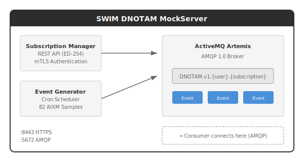
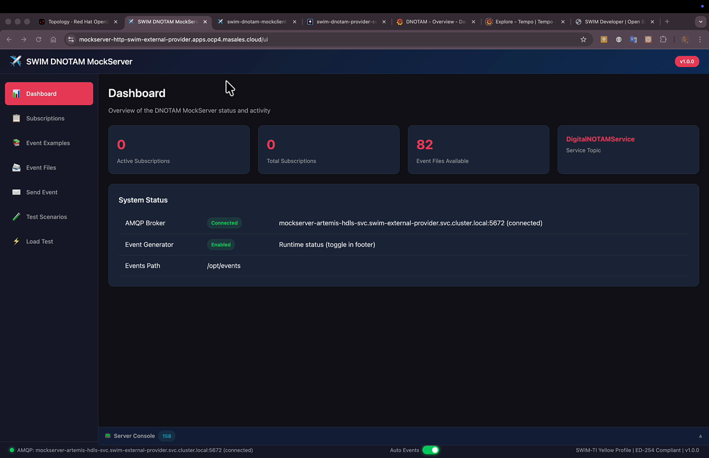

# SWIM DNOTAM MockServer

> ⚠️ **Code Under Review**: Source code is currently under internal review and will be available soon.

Simulates the EUROCONTROL EAD (European AIS Database) for local development and testing of SWIM DNOTAM services.

## What It Does

The MockServer provides a simulation environment for validating DNOTAM Consumer implementations without requiring access to production EUROCONTROL infrastructure.

**Components:**
- **Subscription Manager API** — ED-254 compliant REST endpoints
- **ActiveMQ Artemis Broker** — AMQP 1.0 message broker (deployed separately)
- **Event Generator** — Configurable cron-based AIXM event injection
- **82 Sample Events** — Validated examples for common scenarios

## Sample Event Scenarios

The MockServer includes validated AIXM sample events for the following scenarios. The framework supports any valid AIXM 5.1.1 event.

| Scenario | Code | Description |
|----------|------|-------------|
| Runway Closure | `RWY.CLS` | Temporary/permanent runway closures |
| Aerodrome Closure | `AD.CLS` | Airport closures |
| Taxiway Closure | `TWY.CLS` | Taxiway closures |
| Runway Limitation | `RWY.LIM` | Weight/performance restrictions |
| Aerodrome Limitation | `AD.LIM` | Airport restrictions |
| Surface Condition | `SFC.CON` | Runway contamination |
| Airspace Activation | `SAA.ACT` | Restricted area activation |
| Airspace New | `SAA.NEW` | New airspace definitions |
| Obstacle New | `OBS.NEW` | New obstacles |
| Navaid Unserviceable | `NAV.UNS` | Navigation aid failures |

## Quick Start

### Using the Operator (Recommended)

kind: SwimDnotamMockServer
apiVersion: apps.swim-developer.github.io/v1alpha1
metadata:
  name: mockserver
spec:
  appConfig:
    amqp:
      password: admin
      port: 5672
      username: admin
  certManager:
    issuerName: swim-ca-issuer
    issuerKind: ClusterIssuer
  replicaCount: 1### Container Image

podman pull quay.io/masales/swim-dnotam-mockserver:latest## API Endpoints

| Method | Endpoint | Description |
|--------|----------|-------------|
| `POST` | `/swim/v1/subscriptions` | Create subscription (returns PAUSED) |
| `GET` | `/swim/v1/subscriptions` | List subscriptions |
| `GET` | `/swim/v1/subscriptions/{id}` | Get subscription details |
| `PUT` | `/swim/v1/subscriptions/{id}` | Update status (ACTIVE/PAUSED) |
| `DELETE` | `/swim/v1/subscriptions/{id}` | Delete subscription |
| `GET` | `/swim/v1/topics` | List available topics |
| `GET` | `/swim/v1/topics/{id}` | Get topic details |

## Environment Variables

### HTTP/HTTPS Configuration

| Variable | Default | Description |
|----------|---------|-------------|
| `QUARKUS_HTTP_PORT` | `8080` | HTTP port (health checks) |
| `QUARKUS_HTTP_SSL_PORT` | `8443` | HTTPS port (API traffic) |
| `QUARKUS_HTTP_INSECURE_REQUESTS` | `disabled` | Allow HTTP requests (`enabled`/`disabled`) |

### SSL/TLS Certificates

| Variable | Default | Description |
|----------|---------|-------------|
| `QUARKUS_HTTP_SSL_CERTIFICATE_FILES` | `/certs/server/tls.crt` | Server certificate path |
| `QUARKUS_HTTP_SSL_CERTIFICATE_KEY_FILES` | `/certs/server/tls.key` | Server private key path |
| `QUARKUS_HTTP_SSL_CERTIFICATE_TRUST_STORE_FILE` | `/certs/ca/ca.crt` | CA certificate for client validation |
| `QUARKUS_HTTP_SSL_CERTIFICATE_TRUST_STORE_FILE_TYPE` | `PEM` | Trust store format (`PEM`/`JKS`/`PKCS12`) |

### OpenAPI Configuration

| Variable | Default | Description |
|----------|---------|-------------|
| `MP_OPENAPI_SERVERS` | *(see below)* | Comma-separated list of server URLs |
| `MP_OPENAPI_SERVERS_0_DESCRIPTION` | `MockServer (Development/Testing)` | Description for first server |
| `MP_OPENAPI_SERVERS_1_DESCRIPTION` | `Local Development` | Description for second server |

### Event Generator Configuration

| Variable | Default | Description |
|----------|---------|-------------|
| `EVENT_GENERATOR_ENABLED` | `true` | Enable automatic event generation |
| `EVENT_GENERATOR_SCHEDULE` | `0 */1 * * * ?` | Cron expression (default: every 1 minute) |
| `EVENT_GENERATOR_EVENTS_PATH` | `/opt/events` | Path to AIXM event XML files |

**Cron Expression Format**: `second minute hour day month weekday`

Examples:
- `0 */1 * * * ?` — Every 1 minute
- `0 */5 * * * ?` — Every 5 minutes
- `0 0 */1 * * ?` — Every 1 hour
- `0 30 9 * * ?` — Daily at 09:30

### AMQP Broker Configuration

| Variable | Default | Description |
|----------|---------|-------------|
| `AMQP_BROKER_HOST` | `mockserver-artemis-hdls-svc` | Artemis broker hostname |
| `AMQP_BROKER_PORT` | `5672` | AMQP 1.0 port |
| `AMQP_BROKER_USERNAME` | `admin` | AMQP authentication username |
| `AMQP_BROKER_PASSWORD` | `admin` | AMQP authentication password |

### Logging

| Variable | Default | Description |
|----------|---------|-------------|
| `QUARKUS_LOG_LEVEL` | `INFO` | Log level (`TRACE`/`DEBUG`/`INFO`/`WARN`/`ERROR`) |

## Technology Stack

| Component | Technology |
|-----------|------------|
| Runtime | Quarkus (Native/JVM) |
| Broker | ActiveMQ Artemis |
| Protocol | AMQP 1.0 over TLS 1.2/1.3 |
| Data Model | AIXM 5.1.1 |
| Security | mTLS (Mutual TLS) |

## Standards Alignment

This project aims to align with the following standards:

| Standard | Description | Status |
|----------|-------------|--------|
| EUROCONTROL SPEC-170 | SWIM-TI Yellow Profile | ✅ Implemented, ⏳ Pending Validation |
| EUROCAE ED-254 | Service Interface Bindings | ✅ Implemented, ⏳ Pending Validation |
| EU Regulation 2021/116 | Common Project One (CP1) | ✅ Implemented, ⏳ Pending Validation |
| AIXM 5.1.1 | Aeronautical Information Exchange Model | ✅ Implemented, ⏳ Pending Validation |

## Explore Mockserver

## License

BSD 3-Clause License

---

Part of the [swim-developer](https://swim-developer.github.io) initiative.
